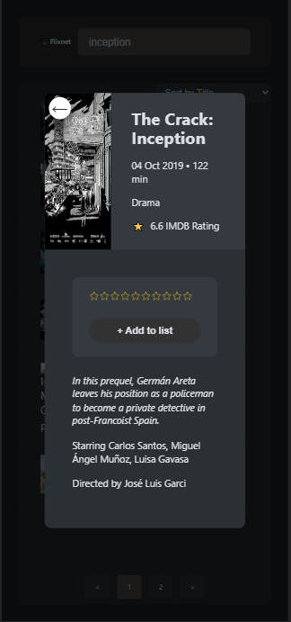

<div id="top"></div>

<!-- PROJECT LOGO -->
<div align="center">

# 🟥 Flixnet 🟫

A movie search app with sorting features, pagination and personalized user stats. This app fetches and uses data from [tmdb API](https://www.themoviedb.org/).

<a href="https://flixnet-ruby.vercel.app/">View Demo</a>

</div>

<!-- ABOUT THE PROJECT -->

<!-- SCREENSHOTS -->

## Screenshots

<table>
    <tr>
      <td>
          
      </td>
      <td>
          
      </td>
      <td>
          
      </td>
    </tr>
</table>

### Built With

List of the frameworks, libraries and tools used to build the project.

- [React.js](https://reactjs.org/)
- [tmdb API](https://www.themoviedb.org/) For the generation of movie data
- [Vercel](https://vercel.com/) For hosting
- [React-Paginate](https://www.npmjs.com/package/react-paginate) For pagination

<!-- GETTING STARTED -->

## Getting Started

1. Clone or fork the repo

```sh
git clone https://github.com/AdaezeIkemefuna/flixnet.git
```

2. Change directory to `flixnet`

```sh
cd flixnet
```

3. Install NPM packages

```sh
npm install
```

4. Run the project

```sh
npm run start
```

<!-- CONTACT -->

<!-- ## Contact

- My website - [https://cosmoart.github.io](https://cosmoart.github.io)
- Twitter - [@CosmoArt0](https://twitter.com/cosmoart0)
- Instagram - [@cosmo_art0](https://www.instagram.com/cosmo_art0/) -->
